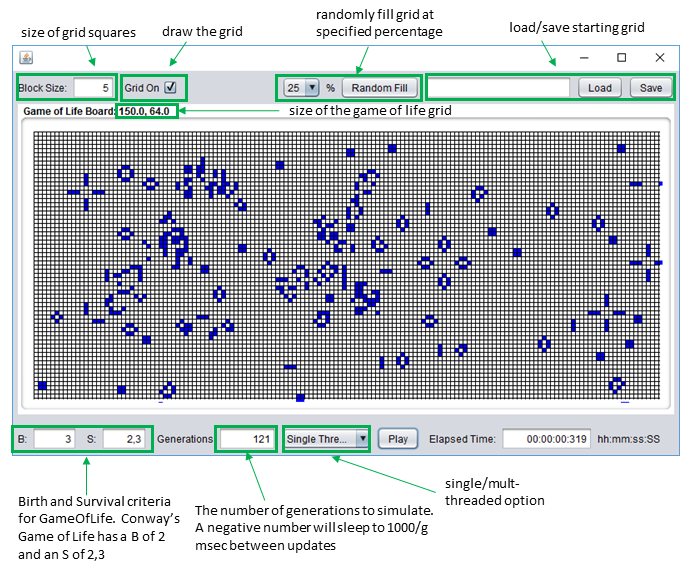

# Assignment02: Game of (Parallel) Life!

GameOfLife is a small Java Swing application for evaluating the Game of Life, a popular simulation of cellular automata.   According to Wikipedia (https://en.wikipedia.org/wiki/Conway%27s_Game_of_Life) 
> The "game" is a zero-player game, meaning that its evolution is determined by its initial state, requiring no further input. One interacts with the Game of Life by creating an initial configuration and observing how it evolves, or, for advanced "players", by creating patterns with particular properties.

**Note:** Since I have coded GameOfLife specifically for this assignment, it may still have some bugs and other limitations. If you encounter any difficulties that hinder you from completing the assignment (or otherwise irritate you beyond reason), please report these back to me.

Your task for this assignment is to make GameOfLife faster and nicer to use. Additionally, you are expected to compare *how much faster* you can simulate life using a parallel programming approach.

The precise list of objectives on which you will be marked is provided further below in this document. You can address objectives in any order that you prefer; in particular, objective #1 does not need to be done first. All objectives are worth approximately the same fraction of the total mark (5% of the total 15%).

## Supplied Code

Because of its GUI, GameOfLife is already a relatively large program, but you will only have to change a few parts of GameOfLife for the purposes of this assignment (although you are welcome to change anything you wish!). Specifically, you will need to modify [`cp3.ass03.LifeProcessor`](/src/cp3/ass03/LifeProcessor.java), which currently only contains sequential Java code (see `compute_java_single()`) for simulating life. If you select anything else from the GUI combo box, it currently throws an `UnsupportedOperationException`. In order to improve the responsiveness of the GUI (as required for Objective #1), you will also need to change some parts of [`cp3.ass03.GameOfLifeGUI`](/src/cp3/ass03/GameOfLifeGUI.java). The `play()` method (the callback method for the "Play" button) is a good starting point.  In this method the line `lp.processLife(generations, computeMode);` is where it is decided who lives and who dies!

## Objective #1: A Responsive GUI (%5)

At present, the GameOfLife GUI "freezes" when you attempt to simulate life; and it can freeze for an extended period of time if there is a lot of generations to simulate or you wish to watch life evolve before your eyes. Your first objective is to improve the user-friendliness of the GUI in this matter. You should inform the user about the progress of the ongoing computation, for example, via a progress dialog of some kind (or by changing existing GUI components).   The user should be given the option to cancel/stop/pause/terminate life at any time.

## Objective #2: Multi-Threaded Java Life Simulation (5%)
Your second objective is to utilize multiple Java threads towards accelerating the simulation of the life. You should use a reasonable number of threads for this; the Java method `availableProcessors()` method from the class `java.lang.Runtime` might be helpful in this context.

A good implementation should take advantage of all the threading capabilities of Java, not just extending the `Thread` class and overriding the `run()` method.  Your code should be thread-safe (i.e., allow multiple threads to consistently and safely share data, possibly using locks and synchronization) and it should be **thread savvy** in that it should not create more threads than necessary and also use concepts such as threads pools.

## Objective #3: Benchmark and Discussion (5%)
So...how much faster is your multi-threaded version of the life simulator? You will have to find out by benchmarking it! Record the processing time for each implementation on a decently sized game board and number of generations and summarize this in a table (and you the marker likes a graph). Please specify what kind of computer you ran your benchmark on, that is the technical specifications of the computer.  You should, for example, give details of the exact speed-up that you observe with different thread numbers (e.g. 1, 2, 4, 8, 100 threads). Provide half a page of description of your benchmark procedure and results; particularly any flaws or unique aspects of your benchmark should be mentioned in writing.

You should also outline how you implemented your threaded version of the GameOfLife.

## Self-review
Well, there is no FLO self-review available for this assignment.  However, a good way to test is if your implementation is correctly operating is to load the `data/glidergun.json` file and if the glidergun correctly generates the gliders then you can be fairly confident that your implementation is operating correctly. 

Your implementation should also **NOT** be throwing any exceptions.  Check the command line for red text!!  If your have not guarded for race conditions then you run the risk of lists being clobbered by another thread!

## Submission of the Assignment

Submission will be via both FLO and the repository.  You should submit the revision number of your repository that you consider your final commit for the assignment to FLO and any other required documents as PDF.  If there are any special requirements for running the program these should be detailed in the document about running your program.  Additional documents should be in PDF format.  If you have utilised additional data files for your assignment and they are too large to upload to FLO or put into the repository then provide a link in your documentation.
